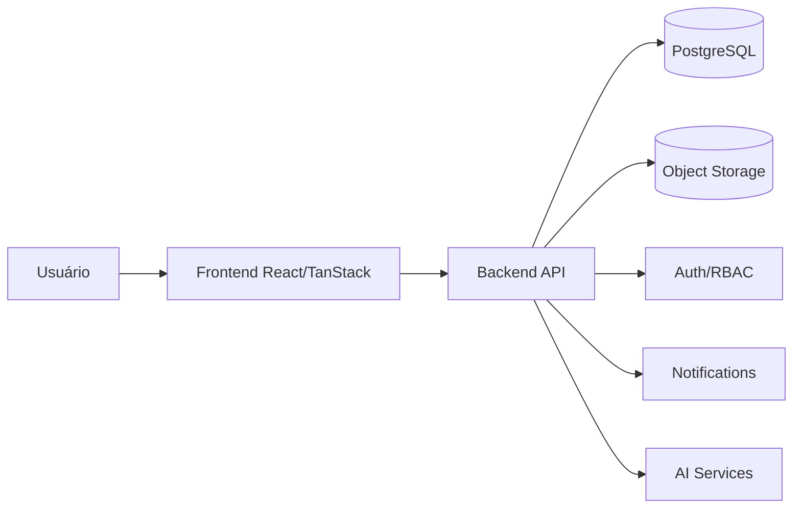
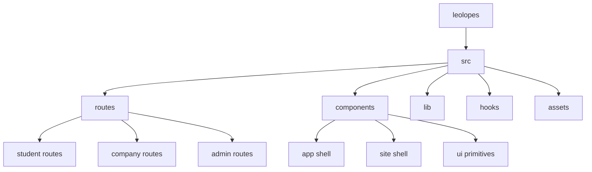
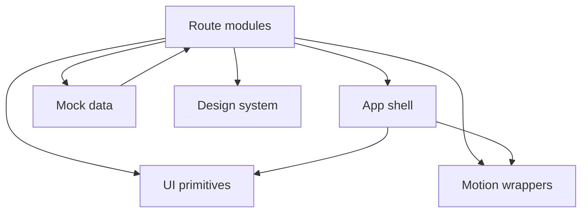
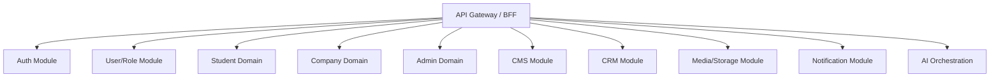
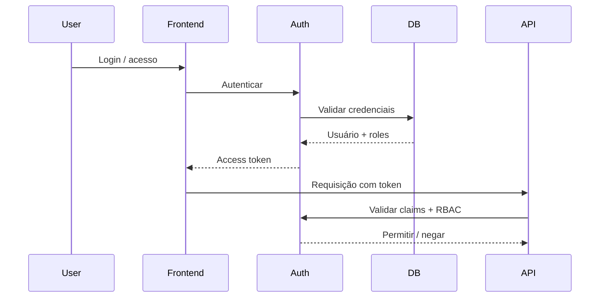
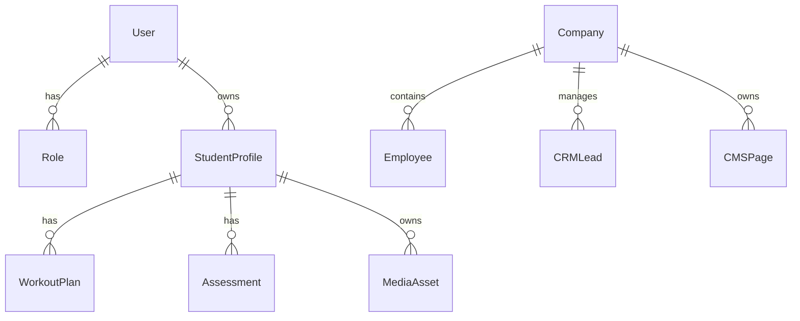

# Leonardo OS — Arquitetura Atual e Caminho de Evolução

## 1. Objetivo

Este documento consolida a avaliação técnica do projeto Leonardo OS com foco em arquitetura, evolução do produto e transição de um protótipo visual para uma plataforma funcional, preservando a interface já validada pelo cliente.

As decisões aqui descritas respeitam as regras de não alterar a identidade visual, não remover páginas, rotas, menus ou seções da landing page, e preservar a compatibilidade com o frontend existente.

---

## 2. Contexto do projeto

O repositório representa um frontend moderno, rico visualmente e bem estruturado para uma experiência premium de produto. A aplicação já oferece:

- landing page sofisticada;
- portal do aluno;
- portal corporativo;
- painel administrativo;
- CMS visual;
- CRM;
- biblioteca de mídia;
- avatar evolutivo;
- IA Coach.

No entanto, a implementação atual ainda é majoritariamente uma camada de apresentação alimentada por dados mockados.

---

## 3. Evidências arquiteturais encontradas

### 3.1 Frontend moderno

A base tecnológica atual é forte:

- React 19
- TypeScript estrito
- TanStack Router
- TanStack Start
- TanStack Query
- Vite
- Tailwind CSS
- Radix UI
- Motion
- Recharts

Esses elementos apontam para uma estrutura adequada para uma aplicação de produto escalável.

### 3.2 Organização por rotas e componentes

A organização atual separa bem o projeto em camadas visuais e estruturais:

- rotas em [src/routes](src/routes)
- componentes em [src/components](src/components)
- utilidades e mocks em [src/lib](src/lib)
- hooks em [src/hooks](src/hooks)
- estilos em [src/styles.css](src/styles.css)

Essa estrutura é limpa para um frontend, mas ainda não representa uma arquitetura de domínio de software.

### 3.3 Dados mockados como base de verdade

O arquivo [src/lib/mock.ts](src/lib/mock.ts) concentra os dados de negócio simulados para:

- landing page;
- aluno;
- empresa;
- admin;
- CRM;
- CMS;
- mídia;
- coach.

Isso é um forte sinal de que a camada de dados ainda não existe de forma real.

---

## 4. Diagnóstico principal

### 4.1 O projeto é um protótipo de produto, não uma plataforma funcional

A aplicação já possui excelente camada visual, navegação e identidade, mas ainda falta a base operacional necessária para se tornar uma plataforma real.

Os principais pontos ausentes são:

- autenticação real;
- autorização e RBAC;
- backend;
- API;
- serviços de domínio;
- repositórios;
- persistência;
- upload e storage;
- notificações;
- observabilidade;
- integração real com IA.

### 4.2 A arquitetura atual não é ainda uma arquitetura de negócio

As rotas e os componentes são bem separados, mas a regra de negócio não está encapsulada em módulos próprios. O resultado é que a lógica de produto ainda está muito ligada à camada de apresentação.

---

## 5. Análise de acoplamento

### 5.1 Acoplamento forte com mocks

As telas dependem diretamente do módulo [src/lib/mock.ts](src/lib/mock.ts), o que torna a camada de apresentação fortemente acoplada a dados artificiais.

### 5.2 Falta de abstração para dados

Não existe uma interface de serviço ou contrato de API entre frontend e camada de dados. Isso significa que qualquer mudança real de backend exigirá reestruturação significativa.

### 5.3 Lógica de UI misturada com conceito de produto

Algumas telas já expressam comportamento de produto, mas ainda sem uma camada de aplicação isolada. Isso torna a evolução mais difícil e aumenta o risco de duplicação.

---

## 6. Pontos fortes da arquitetura atual

- estrutura de frontend bem organizada;
- roteamento claro e escalável;
- design system consistente;
- componentes reutilizáveis e bem separados;
- experiência visual premium;
- boa base para evolução incremental.

---

## 7. Pontos fracos e riscos

### 7.1 Risco de segurança

A aplicação ainda não possui:

- autenticação real;
- autorização por função;
- validação server-side;
- proteção de dados sensíveis.

### 7.2 Risco de escalabilidade

O uso de estado local e mocks dificulta a evolução para:

- múltiplos usuários;
- dados persistidos;
- workflows complexos;
- integração com regras de negócio reais.

### 7.3 Risco de manutenção

Sem uma camada de domínio e serviço, a evolução tende a espalhar regras de negócio por múltiplas rotas e componentes.

### 7.4 Risco de qualidade

Não há evidência de uma estratégia sólida de testes, observabilidade e CI/CD para esse estágio de produto.

---

## 8. Arquitetura recomendada para a próxima fase

A recomendação mais saudável é evoluir para uma arquitetura modular com separação clara entre frontend e backend, mantendo a interface atual intacta.

### 8.1 Frontend

Manter:

- React
- TanStack Start
- TanStack Router
- TanStack Query

Mas introduzir:

- camada de API client;
- contratos tipados;
- serviços de domínio;
- hooks para dados reais;
- state management para dados de sessão e domínio.

### 8.2 Backend

Propor uma base backend em TypeScript com separação de módulos por domínio:

- auth
- users
- student
- company
- admin
- content
- media
- crm
- notifications
- ai

### 8.3 Persistência

Recomendação inicial:

- PostgreSQL
- Prisma ou ORM equivalente
- storage object para mídia e documentos
- filas para eventos e notificações

### 8.4 Segurança

Implementar desde o início:

- identidade e sessão;
- RBAC;
- validação server-side;
- audit logs;
- proteção de endpoints;
- upload seguro com presigned URLs.

---

## 9. Arquitetura proposta em camadas

---

## 10. Estrutura de pastas recomendada

---

## 11. Mapa de dependências atual

---

## 12. Arquitetura de backend proposta

---

## 13. Fluxo de autenticação proposto

---

## 14. Domínios de banco sugeridos

---

## 15. Plano de implementação prioritário

### Fase 1 — Fundação

1. Definir contratos de API.
2. Criar backend base em TypeScript.
3. Implementar autenticação e sessão.
4. Criar camada de autorização.

### Fase 2 — Migração de dados

1. Substituir mocks por serviços reais.
2. Criar repositórios para aluno, empresa, admin e conteúdo.
3. Popular o banco com seed inicial.

### Fase 3 — Domínios críticos

1. Student domain.
2. Company domain.
3. Admin domain.
4. CMS e CRM.

### Fase 4 — Mídia e documentos

1. upload;
2. armazenamento seguro;
3. presigned URLs;
4. metadados e thumbnails.

### Fase 5 — Comunicação e IA

1. notificações;
2. eventos;
3. integração com IA Coach via serviço isolado.

### Fase 6 — Qualidade

1. testes unitários e integração;
2. testes de acessibilidade;
3. observabilidade;
4. CI/CD.

---

## 16. Recomendação final

A base do projeto é excelente para evoluir, mas a próxima fase deve deixar de ser exclusivamente a construção de telas e passar a modelar domínio, serviços, dados e segurança.

A interface já validada deve permanecer como referência oficial e todas as novas camadas devem ser adicionadas sem quebrar o fluxo visual atual.

A estratégia ideal é:

- preservar o frontend atual;
- introduzir API e serviços tipados;
- migrar mocks para persistência real;
- separar regras de negócio por módulos;
- implementar auth/RBAC desde a primeira fase.
